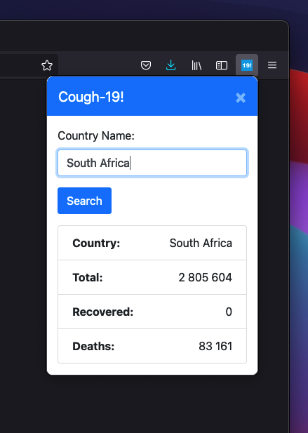

# Cough-19
Simple browser extension created with JS.  
Covid-19 data gotten from [api](https://covid19.mathdro.id/api) (api not returning recovered stat at time of writing).

## Features
* Shows total stats (cases, recovered and deaths) of the world
* Shows total stats (cases, recovered and deaths) of specified country 

## How to use
### Add extension to browser
#### Firefox
1. Go to `about:debugging` and click `"This Firefox"`
2. Click the `"Load Temporary Add-on..."` button
3. Navigate to `cough-19` folder and open the `manifest.json` file

#### Chrome
1. Go to `chrome://extensions/`
2. Click the `Load unpacked` button
3. Navigate to `cough-19` folder and open the `dist` folder

### Use extension
1. Click on extension icon in the toolbar
2. Enter country name in text box and click search
   * The extension starts with the global stats (remove text from the input box or enter "Global" to get global stats)

## Disclaimer
I made this extension to learn how to make browser extensions. The [api](https://covid19.mathdro.id/api) stopped returning the recovered stat at the time of writing. It might return one day so I'm leaving the recovered field in the extension.  
Good luck and have fun.
